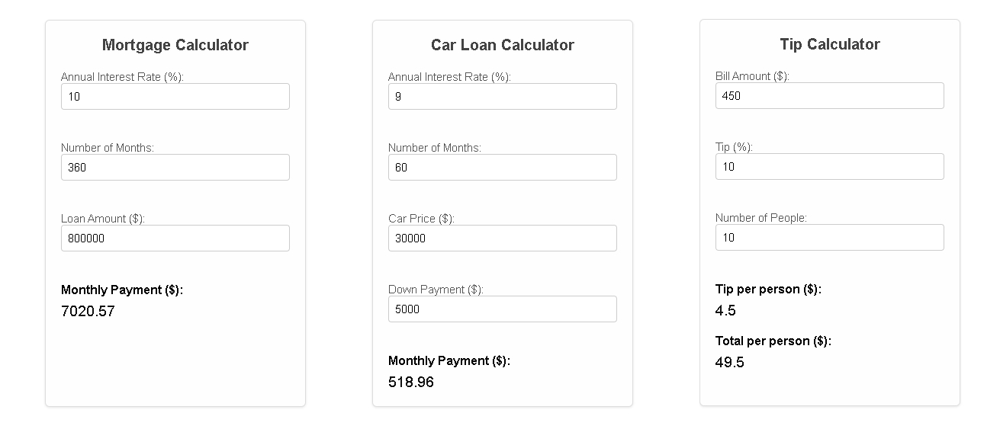

# Dynamic Calculators

A lightweight, [HyperFormula](hyperformula.handsontable.com)-powered library that converts simple HTML
markup into interactive calculators. Just define a basic `<div>` with
`<input>` fields and formula placeholders, and call
`BuildDynamicCalculators()` to transform it into a fully functional,
real-time calculator widget.



## Features

- **Minimal Markup**: Use a single `<div>` with minimal HTML attributes.
- **Formula-Driven**: Leverage [HyperFormula](hyperformula.handsontable.com) to power calculations with
  Excel-like functions.
- **Dynamic Updates**: Automatic recalculation on input changes.
- **Easy Styling**: Default CSS styles are provided, with JavaScript
  adding extra classes for enhanced layout.
- **Multiple Examples**: Includes three sample calculators to showcase
  versatility.
- **Global Named Expressions**: All inputs are mapped to global named
  expressions with unique prefixes to avoid collisions.


## Getting Started

## Usage

To use the library in your own project:

1. Include the HyperFormula library from a CDN, and either your own copy of 
   `script.js`, and `styles.css` of from a CDN too in your HTML `<head>`:

   ```html
   <script src="https://cdn.jsdelivr.net/npm/hyperformula/dist/hyperformula.full.min.js"></script>
   <script src="script.js"></script>
   <link rel="stylesheet" href="styles.css">
   <!-- Or also using https://raw.githack.com-->
   <script src="https://raw.githack.com/hasielhassan/DynamicCalculatorJS/v0.0.1/script.js"></script>
   <link rel="stylesheet" href="https://raw.githack.com/hasielhassan/DynamicCalculatorJS/v0.0.1/styles.css">

   ```

2. Create your calculator markup by using a container `<div>`
   with the class `DynamicCalculator`. Define your inputs and result
   placeholders as shown below:

   ```html
   <div class="DynamicCalculator" data-title="Mortgage Calculator">
     <label>
       Annual Interest Rate (%):
       <input type="number" id="rate" min="0" step="1" value="8">
     </label>
     <br>
     <label>
       Number of Months:
       <input type="number" id="months" min="0" value="360">
     </label>
     <br>
     <label>
       Loan Amount ($):
       <input type="number" id="amount" min="0" value="800000">
     </label>
     <br>
     <strong>Monthly Payment ($):</strong>
     <span class="CalculatedResult" id="payment"
           data-formula="ROUND(PMT((rate/100)/12, months, -amount), 2)">
     </span>
   </div>
   ```

   Formulas can use any of the built in functions from HyperFormula, you can check the guide and documentation for them here:
   https://hyperformula.handsontable.com/guide/built-in-functions.html

3. When the DOM is loaded, call `BuildDynamicCalculators()` to
   initialize the calculators:

   ```html
   <script>
     document.addEventListener('DOMContentLoaded', BuildDynamicCalculators);
   </script>
   ```

All defined inputs are converted into global named expressions (with
unique prefixes), and formulas in the result elements are updated
accordingly. HyperFormula handles recalculation automatically.

---

## Examples

The sample page (`index.html`) includes three examples:

1. **Mortgage Calculator**: Calculates monthly payment using the
   `PMT` function.
2. **Car Loan Calculator**: Similar to the mortgage example, but factors
   in a down payment.
3. **Tip Calculator**: Computes tip per person and total per person.


## License

This project is licensed under the **MIT** license. See the [LICENSE](LICENSE)
file for details.
